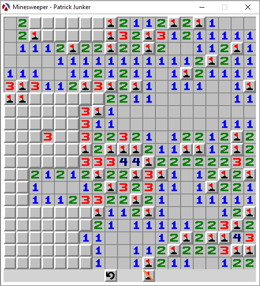

# Uni-Projekt: Minesweeper in der funktionalen Sprache Racket

Kleines Abschlussprojekt des Moduls Funktionale Programmierung, in dem wir mit der Programmiersprache Racket(basierend auf Lisp) gearbeitet haben.
Der Pragrammcode ist in einer .rkt Datei kodiert, deshalb habe ich ihn nochmal als .txt abgelegt, um ihn in Github richtig darzustellen.

